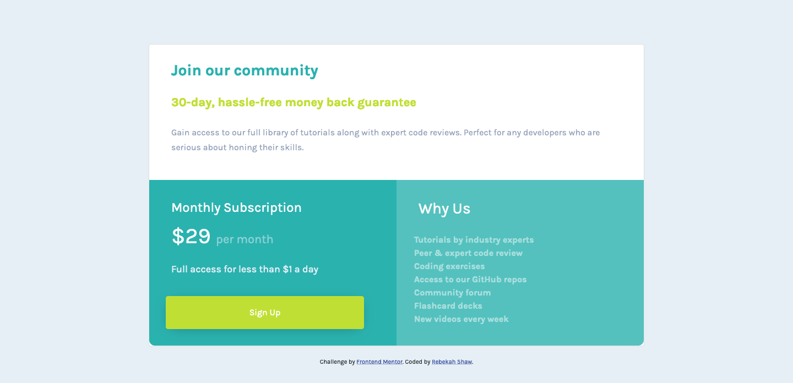

# Frontend Mentor - Single price grid component solution

This is a solution to the [Single price grid component challenge on Frontend Mentor](https://www.frontendmentor.io/challenges/single-price-grid-component-5ce41129d0ff452fec5abbbc). Frontend Mentor challenges help you improve your coding skills by building realistic projects. 

## Table of contents

- [Overview](#overview)
  - [The challenge](#the-challenge)
  - [Screenshot](#screenshot)
  - [Links](#links)
- [My process](#my-process)
  - [Built with](#built-with)
  - [What I learned](#what-i-learned)
  - [Continued development](#continued-development)
  - [Useful resources](#useful-resources)
- [Author](#author)

## Overview

### The challenge

Users should be able to:

- View the optimal layout for the component depending on their device's screen size
- See a hover state on desktop for the Sign Up call-to-action

### Screenshot

#### Desktop

#### Mobile

### Links

- Solution URL: [ Solution](https://github.com/rebekahshaw92//
single-price-grid-component)
- Live Site URL: [Live Site](https://rebekahshaw92.github.io//
single-price-grid-component)

### Built with

- Semantic HTML5 markup
- CSS custom properties
- Sass
- Bootstrap 5
- Mobile-first workflow

### What I learned

While I did this project I learned more about Bootstrap columes and row.

### Cotinued Development

I want to continue working with Bootstrap and learn all the things I am able to do with it.

### Userful Resources 

- [Bootstrap]https://getbootstrap.com) - This site helped me learn all I needed to know about Bootstrap.

## Author

- Website - [Rebekah Shaw](https://www.rebekahshaw.com)
- Frontend Mentor - [@rebekahshaw92](https://www.frontendmentor.io/profile/rebekahshaw92)
- Twitter - [@x_beckyboo_x](https://www.twitter.com/x_beckyboo_x)